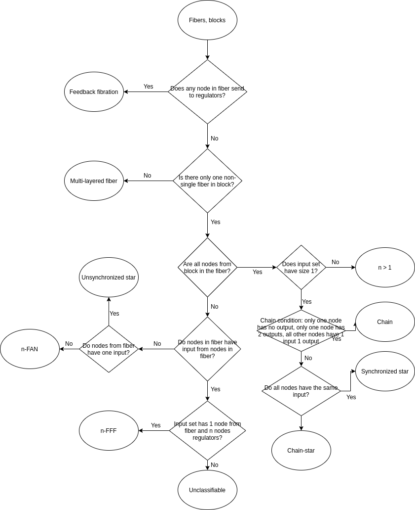

# Functions to work with fibration symmetries.

Author: **Ian Leifer, Levich Institute and Physics Department, City College of New York, New York, NY 10031**

## Installation

```r
# Install the package from the GitHub directly in RStudio by running:
devtools::install_github("ianleifer/fibrationSymmetries")
```

## Usage

### Get balanced coloring
get.balanced.coloring.Kamei() finds the minimal balanced coloring of the graph using the algorithm introduced by Kamei and Cock.

get.balanced.coloring.Kamei() function finds a minimal balanced coloring based on the algorithm developed in (1). This function supports directed and undirected cases as well as weighted and unweighted cases. Directionality is defined by the variable "directed" and weightedness is defined by the number of columns in the input data (2 for undirected and 3 for directed). Input graph is specified using "raw_edges", "file", "sep" and "header" variables.

(1) Kamei H, Cock PJ. A. Computation of balanced equivalence relations and their lattice for a coupled cell network. SIAM J Appl Dyn Syst. 2013;12,352-382.

#### Examples:
##### Directed case
```r
nodes = get.balanced.coloring.Kamei(file = "Network.txt", sep = ";", directed = T)
nodes
```

##### Undirected case
```r
graph = erdos.renyi.game(500, 350, type = "gnm")
nodes = get.balanced.coloring.Kamei(raw_edges = data.frame(as_edgelist(graph)))
nodes
```

### Get fiber building blocks

get.building.blocks()	gets fiber building blocks classification and/or figures and raw data. 

get.building.blocks() is used to get fiber building block classification and/or figures and raw data. Returns the list of fiber building blocks as defined in (1) that correspond to the network specified using "raw_edges", "file", "sep" and "header" variables. Classification is returned by default. Classification is obtained following the block diagram below. To get additional output specify "outputFolder" variable and "csv", "png" or "pdf" variables.

(1) Morone F, Leifer I, Makse HA. Fibration symmetries uncover the building blocks of biological networks. Proc Natl Acad Sci USA. 2020;117(15):83068314.

#### Block diagram
Diagram


#### Examples:

##### Get building block classification
```r
buildingBlocks = get.building.blocks(file = "Network.txt")
buildingBlocks
```

##### Get building block classification and put the node list and the edge list in the csv format in the "buildingBlocks" folder
```r
buildingBlocks = get.building.blocks(file = "Network.txt", outputFolder = "buildingBlocks", csv = T)
buildingBlocks
```

##### Get building block classification and put the node list, the edge list in the csv format and figures in png format in the "buildingBlocks" folder
```r
buildingBlocks = get.building.blocks(file = "Network.txt", outputFolder = "buildingBlocks", csv = T, png = T)
buildingBlocks
```

##### Get building block classification and put the building block summary in the pdf format in the "buildingBlocks" folder
```r
buildingBlocks = get.building.blocks(file = "Network.txt", outputFolder = "buildingBlocks", pdf = T)
buildingBlocks
```

### Get fiber building block p-values

get.building.block.pvalues() gets p-values corresponding to fiber building blocks.

get.building.block.pvalues() function finds fiber building block p-values. That is, the probability (estimated on the sample of the size "sampleSize") of having the number of building blocks in the graph (specified using "raw_edges", "file", "sep" and "header" variables) with the certain fiber numbers or belonging to the certain class or having the certain block name (depending on the "mode" variable) in the random network (with the same degree sequence or created by Erdos-Renyi depending on "method" variable).

#### Examples:

##### Get p-values of |n, l> classification of the network in file "Network.txt".
```r
buildingBlockPvalues = get.building.block.pvalues(file = "Network.txt", sampleSize = 1000, mode = "nl", method = "degreeSequence")
buildingBlockPvalues
```

##### Get p-values of the fiber class (i.e. Chain, FAN fiber, Feedback Fiber, Feed-Forward Fiber etc.) of the network in file "Network.txt" randomizing using Erdos-Renyi model with the same number of nodes and edges.
```r
buildingBlockPvalues = get.building.block.pvalues(file = "Network.txt", sampleSize = 1000, mode = "Class", method = "erdosrenyi")
buildingBlockPvalues
```

### Get ISCV (Input Set Color Vector)
get.input.set.color.vector() finds the ISCV (Input Set Color Vector) of all nodes in the graph given the coloring.

get.input.set.color.vector() finds ISCVs (Input Set Color Vectors as defined in SI VI of (1)) of all nodes in the graph given the coloring of the graph. Coloring is specified by "nodes" variable formatted as the output of the get.balanced.coloring.Kamei() function. Input graph is specified using "raw_edges", "file", "sep" and "header" variables. **Note, works for both directed and undirected networks.**

(1) Leifer I, Morone F, Reis SDS, Andrade JS, Sigman M, Makse HA. Circuits with broken fibration symmetries perform core logic computations in biological networks. PLoS Comput Biol 2020;16(6):e1007776.

#### Examples:

##### Get the ISCV that was used on the last step of coloring of the network in file "Network.txt".
```r
nodes = get.balanced.coloring.Kamei(file = "Network.txt", directed = T)
ISCVs = get.input.set.color.vector(nodes = nodes, file = file, directed = T)
ISCVs
```

## License

This project is licensed under the MIT License - see the [LICENSE.md](LICENSE.md) file for details
